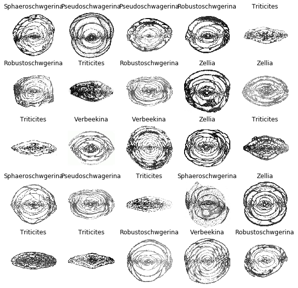
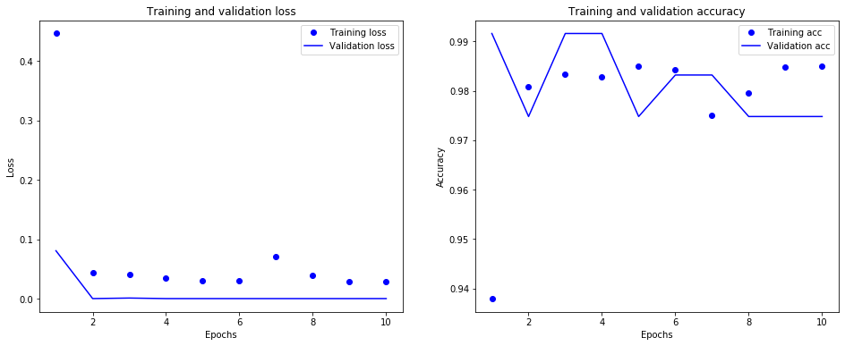

### Experiment on Convolutional Neural Network – Identifying fusulinids

(under construction)               

@author: Meng Chen

------------
### Introduction

Fusulinids are one of the most informative fossils present in the stratigraphic horizon. Particularly, petroleum industry relies on them to for signaing the deposit layer of oil and natural gas. Certain species only occurred in those horizon. Identifying species becomes endless effort by oil industry. Recently, the machine learning becomes more practical, from a simple chatbot from the customer service of AT&T, to the prodcut recommendation system of Amazon, and to the sophistical AlphaGo of Google AI. Machine learning becomes more and more close to our regular life and even challenge the current life choice (e.g., self-driving car) and maybe replace our jobs (e.g., truck drivers) in near future.

Today, With computational power increases drastically, the machine learning implementation is not the personal matter of the supercomputer anymore, workstation or even a personal computer can successfully training the model with proper specs (e.g., Nivdia Quadro graphic card with CUDA enabled). To pioneering implementation of machine learning techniques in paleobiology, my collaborators and I have investigated how to identify fusulinids with convolutional neural network (CNN). The projects will have two phases based on the quality of the data, fined-tuned images vs raw images. The ultimate goal of this project will be the implementation of CNN for identifying the fusulinids species without numerous manual tuning on the original images, saving workload for initial assessments of the new genus or species. Broadly, this project will build a framework for identifying organism elements, teeth for example, to help differentiate the species identity or functions based on physical morphology. It should be noted that this project was inspired by [U-Net: Convolutional Networks for Biomedical Image Segmentation](http://lmb.informatik.uni-freiburg.de/people/ronneber/u-net/).

Currently, the project completed the first phase and will move on by gathering a large stack of the raw images to train the CNN model and to assess if this approach is practical for identifying the species.

### Data

The data was provided by [Dr. Yikun Shi](https://es.nju.edu.cn/crebee/fjs/list.htm), Deputy Director of the [Centre for Research and Education on Biological Evolution and Environment](https://es.nju.edu.cn/crebee/), Nanjing University. The image data has been heavily preprocessed by adjusting the contrast and brightness and cropping out non-informative parts of the original images. Every image has also been resized to the same size as well as for the same resolution. See some examples in the sample folder.



**Fig. 1** Some examples of the fusulinid images in the dataset.

### Data augmentation

The original dataset has 119 images, which were far from enough for deep learning neural network. I used `ImageDataGenerator` in `keras.preprocessing.image` to augment dataset with 6,579 images. I used `flow_from_directory` from `ImageDataGenerator` to build training and validation batches. Each training batch has 32 samples, while each validation batch has one sample.

### Model

The convolutional neural network (CNN) is implemented with `Keras` API (`TensorFlow` backend). Because the images of fusulinids are less complicated than those of biomedical counterparts, our CNN model is a much simpler architecture than that of U-net. In total, the CNN has 31,641,670 trainable parameters in total. I applied `Adam` as optimizer, `sparse_categorical_crossentropy` for loss function, and  `mse` for validation metrics. See the codes below for details.

```python
def build_cnn(input_size=(255, 255, 3)):
    inputs = Input(input_size)
    conv1 = Conv2D(128, 3, activation='relu')(inputs)
    conv1 = Conv2D(128, 3, activation='relu')(conv1)
    pool1 = MaxPooling2D(pool_size=(4, 4))(conv1)
    flat1 = Flatten()(pool1)
    relu1 = Activation('relu')(flat1)
    drop1 = Dropout(rate=0.5)(relu1)
    dense1 = Dense(64, activation='relu')(drop1)
    dense2 = Dense(6, activation='softmax')(dense1)
    model = Model(inputs=inputs, outputs=dense2)
    model.compile(optimizer='Adam',
                  loss='sparse_categorical_crossentropy',
                  metrics=['accuracy'])
    return model
```

### Results

The accuracy of the CNN model for 10-epoch training session is 0.9850 and 0.9748 for training and validation datasets, respectively. These are encouraging results for implementing the CNN for identifying the fusulinids at the first phase.


**Fig. 2** The results of the training of CNN models on fusulinids.

### Next step

After the first phase of identifying the fusulinids successfully using well-preprocessed images, we are moving the projects forward to using raw data. Currently, we are still in collecting a much larger dataset of raw images of the fusulinids.
