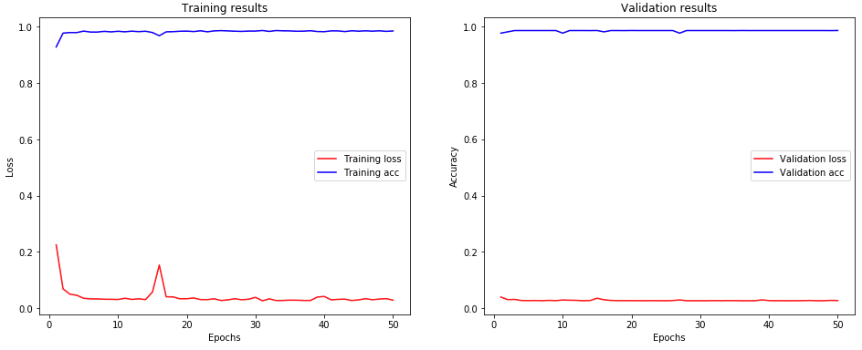

# Fusulinids species identification

**A ML implementation using Convolutional Neural Network (CNN) to identify extinct species**

**Meng Chen**, **Yukun Shi**                          
Centre for Research and Education on Biological Evolution and Environment          
School of Earth Sciences and Engineering                                                          
Nanjing University, Nanjing, China, 210093                           

------------
### Introduction

Fusulinids is one of the most informative fossils present in the stratigraphic horizon. Particularly, petroleum industry relies on them to for signaling the deposit layer of oil and natural gas, as some species act as indication of productive layers. Identifying species becomes endless effort by oil industry. Recently, the machine learning becomes more practical, from a simple chatbot from the customer service of AT&T, to the product recommendation system of Amazon, and to the sophistical AlphaGo of Google AI. Machine learning becomes more and more close to our regular life and even challenge the current life choice (e.g., self-driving car) and maybe automate our jobs (e.g., truck drivers) in near future.

Today, with computational power increases drastically, the machine learning implementation is not the matter of the supercomputer anymore, a workstation or even a personal computer can successfully training the model with proper specs (e.g., Nvidia Quadro graphic card with CUDA enabled). To pioneering implementation of machine learning techniques in paleobiology, my collaborators and I have investigated how to identify fusulinids with convolutional neural network (CNN). Our project intends to speed up the identification of fusulinids species in order to improve research and industrial pipeline. The promising results suggests that by using machine learning techniques, such as CNN in our study, we can increase productivity in both academic and industrial researches.


### Data

The data was provided by [Dr. Yikun Shi](https://es.nju.edu.cn/crebee/fjs/list.htm), Deputy Director of the [Centre for Research and Education on Biological Evolution and Environment](https://es.nju.edu.cn/crebee/), Nanjing University. The image data has been heavily preprocessed by adjusting the contrast and brightness and cropping out non-informative parts of the original images. Each image has also been resized to the same size as well as for the same resolution. See some examples in the sample folder.

The original dataset has 119 images, which were far from enough for deep learning neural network. After the data augmentation, we have 6,928 images in total for the training the CNN model.


**Fig. 1** Some examples of the fusulinid images in the dataset.

### Model

The neural network architecture was inspired by the [U-net](https://lmb.informatik.uni-freiburg.de/people/ronneber/u-net), and it was implemented with Keras API (TensorFlow backend). Because the images of fusulinids were heavily processed than those of biomedical counterparts, our CNN model is was much simpler architecture than that of U-net. In total, our CNN has 31,723,782 trainable parameters. See the codes below for details.

```python
def build_cnn(input_size=(255, 255, 3)):
    inputs = Input(input_size)
    conv1 = Conv2D(128, 3, activation='relu')(inputs)
    conv2 = Conv2D(128, 3, activation='relu')(conv1)
    conv3 = Conv2D(64, 3, activation='relu')(conv2)
    pool1 = MaxPooling2D(pool_size=(4, 4))(conv3)
    flat1 = Flatten()(pool1)
    relu1 = Activation('relu')(flat1)
    drop1 = Dropout(rate=0.5)(relu1)
    dense1 = Dense(128, activation='relu')(drop1)
    drop2 = Dropout(rate=0.5)(dense1)
    dense2 = Dense(64, activation='relu')(drop2)
    dense3 = Dense(6, activation='softmax')(dense2)
    model = Model(inputs=inputs, outputs=dense3)
    model.compile(
        optimizer='Adam',
        loss='sparse_categorical_crossentropy',
        metrics=['accuracy']
    )
    return model
```

### Results

The accuracy of the CNN model for 50-epoch training session is 0.9852 and 0.9863 for training and validation datasets, respectively. These are encouraging results for implementing the CNN for identifying the fusulinids at the first phase.


**Fig. 2** The results of the training of CNN models on fusulinids.

### Future step

After the first phase of identifying the fusulinids successfully using well-preprocessed images, we are moving the projects forward to using raw data. Currently, we are still in collecting a much larger dataset of raw images of the fusulinids.
